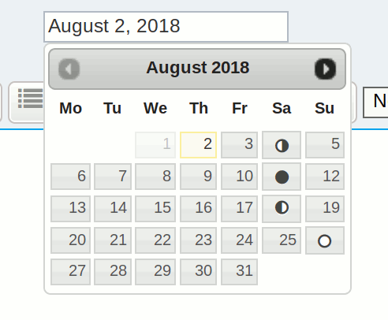

# phpBB Extension - marttiphpbb Datepicker Lunar (helper ext)

[Topic on phpBB.com](https://www.phpbb.com/community/viewtopic.php?f=456&t=2481086)

This phpBB extension shows the phases of the moon for the [JQuery UI Datepicker extension](https://github.com/marttiphpbb/phpbb-ext-jqueryuidatepicker)

## Screenshot

## Requirements

* phpBB 3.2.1+
* PHP 7.1+
* [JQuery UI Datepicker extension](https://github.com/marttiphpbb/phpbb-ext-jqueryuidatepicker)
* [Font Awesome Icons](https://fontawesome.com/) (Is present in Prosilver)

## Quick Install

You can install this on the latest release of phpBB 3.2 by following the steps below:

* Create `marttiphpbb/datepickerlunar` in the `ext` directory.
* Download and unpack the repository into `ext/marttiphpbb/datepickerlunar`
* Enable `Datepicker Lunar` in the ACP at `Customise -> Manage extensions`.

## Uninstall

* Disable `Datepicker Lunar` in the ACP at `Customise -> Extension Management -> Extensions`.
* To permanently uninstall, click `Delete Data`. Optionally delete the `/ext/marttiphpbb/datepickerlunar` directory.

## Support

* Report bugs and other issues to the [Issue Tracker](https://github.com/marttiphpbb/phpbb-ext-datepickerlunar/issues).

## License

[GPL-2.0](license.txt)
